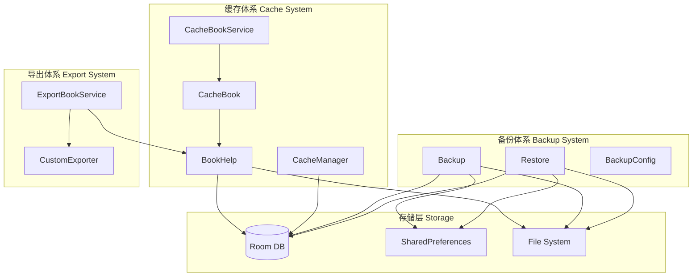

# 缓存与导出/备份机制详解

## 快速理解

把这个系统的缓存和备份导出机制比喻成**图书馆的两种服务**：

1. **缓存机制** → 图书馆的**"预借书服务"**
   - 读者还没来借书，图书馆提前把热门书准备好
   - CacheBookService 是"管理员"，负责批量预加载
   - BookHelp 是"书架管理员"，负责实际存储和读取章节内容

2. **导出/备份机制** → 图书馆的**"搬家服务"**
   - Backup 是"打包员"，把所有图书目录（数据库）、规章制度（配置）打成 ZIP 包
   - Restore 是"拆包员"，把 ZIP 包里的东西恢复到新图书馆
   - ExportBookService 是"抄书员"，把一本书抄写成 TXT/EPUB 格式

---

## 架构图解



---

## 一、缓存机制

### 1. CacheManager（通用内存缓存）

负责应用级别的数据缓存。

**核心存储结构：**

- **LruCache** (`memoryLruCache`) - 内存缓存，最多 50MB
- **Room DB** (`Cache` 表) - 磁盘缓存，支持过期时间
- **ACache** - 文件缓存

**关键源码：**

```kotlin
// 三层缓存读取顺序：内存 → 数据库 → 返回null
fun get(key: String): String? {
    getFromMemory(key)?.let { ... return it }  // 第一层：内存
    val cache = appDb.cacheDao.get(key)         // 第二层：数据库
    if (cache != null && (cache.deadline == 0L || cache.deadline > System.currentTimeMillis())) {
        return cache.value.also { putMemory(key, it) }  // 写回内存
    }
    return null
}
```

**文件位置：** `app/src/main/java/io/legado/app/help/CacheManager.kt`

### 2. CacheBookService（书籍离线缓存服务）

后台预加载书籍章节的服务，负责批量下载书籍内容供离线阅读。

**工作流程：**

```
用户选择缓存书籍
       │
       ▼
CacheBookService.startCommand(IntentAction.start)
       │
       ▼
CacheBook.getOrCreate(bookUrl) 创建缓存任务
       │
       ├─── 书籍无目录 ───→ WebBook.getChapterListAwait() 加载目录
       │
       ▼
cacheBook.addDownload(start, end) 添加下载范围
       │
       ▼
CacheBook.startProcessJob() 并行下载章节
       │
       ▼
BookHelp.saveContent() 保存到文件
```

**关键参数：**

- `threadCount` - 并行下载线程数（默认来自 AppConfig）
- `downloadPool` - 线程池执行器
- `Mutex` - 互斥锁，防止多线程冲突

**文件位置：** `app/src/main/java/io/legado/app/service/CacheBookService.kt`

### 3. BookHelp（内容存储核心）

负责章节内容的实际读取和保存，是缓存体系的核心：

- **getContent()** - 读取书籍某章节内容
- **saveContent()** - 保存章节内容到文件
- **getImage()** - 获取书籍相关图片

---

## 二、导出机制（书籍导出为 TXT/EPUB）

将书籍内容导出为可移植的电子书格式。

**文件位置：** `app/src/main/java/io/legado/app/service/ExportBookService.kt`

### 导出流程总览

```kotlin
export()
   │
   ├── 读取书籍信息 appDb.bookDao.getBook(bookUrl)
   │
   ├── 刷新目录 refreshChapterList()
   │
   ├── 选择导出格式
   │     ├── "epub" → exportEpub() / CustomExporter
   │     └── "txt" → exportTxt()
   │
   └── 保存到文件 + 可选上传WebDav
```

### TXT 导出流程

```kotlin
exportTxt(path, book)
   │
   ├── 创建输出文件 bookDoc
   │
   ├── 遍历章节 getAllContents()
   │     ├── 读取内容 BookHelp.getContent()
   │     ├── 处理替换规则 ContentProcessor.getContent()
   │     └── 提取图片 SrcData 列表
   │
   ├── 写入文件 + 保存图片到子目录
   │
   └── 可选导出到 WebDav
```

**TXT 导出的特点：**

- 支持自定义字符编码（默认 UTF-8）
- 图片可选择嵌入或外置保存
- 并行导出可提升速度（配置项 `parallelExportBook`）

### EPUB 导出流程

```kotlin
exportEpub(fileDoc, book)
   │
   ├── 创建 EpubBook 对象
   │
   ├── 设置元数据 setEpubMetadata()
   │     ├── title, author, language, description
   │     └── publisher = "Legado"
   │
   ├── 设置封面 setCover()
   │     └── 使用 Glide 加载封面为 LazyResource
   │
   ├── 设置样式 setAssets()
   │     ├── 内置模板：epub/assets 目录
   │     └── 外部模板：从用户指定的 Asset 目录读取
   │
   ├── 设置正文 setEpubContent()
   │     ├── 并行读取章节内容
   │     ├── 修复图片路径 fixPic()
   │     └── 添加到 epubBook.addSection()
   │
   └── EpubWriter.write() 写入文件
```

**EPUB 元数据设置：**

```kotlin
private fun setEpubMetadata(book: Book, epubBook: EpubBook) {
    val metadata = Metadata()
    metadata.titles.add(book.name)                    // 书籍名称
    metadata.authors.add(Author(book.getRealAuthor())) // 作者
    metadata.language = "zh"                          // 语言
    metadata.dates.add(Date())                       // 创建日期
    metadata.publishers.add("Legado")                // 出版者
    metadata.descriptions.add(book.getDisplayIntro()) // 简介
    epubBook.metadata = metadata
}
```

### 自定义分割导出 (CustomExporter)

当用户需要将一本书分割成多个 EPUB 文件时使用。

**使用场景：**

- 书籍章节过多，单个 EPUB 文件过大
- 需要按卷/部分割导出

**核心逻辑：**

```kotlin
CustomExporter(scopeStr, size)
   │
   ├── parseScope() 解析范围字符串 "1-50,100-150"
   │
   ├── createEpubs() 创建多个 EpubBook 对象
   │
   ├── setEpubContent() 写入正文
   │
   └── save2Drive() 保存并可上传 WebDav
```

**范围字符串解析示例：**

```
输入: "1-50,100-150"
输出: {0, 1, 2, ..., 49, 99, 100, ..., 149}
```

---

## 三、备份机制

### 1. Backup（数据备份）

将应用的全部数据打包备份，包括数据库、配置文件、用户设置等。

**文件位置：** `app/src/main/java/io/legado/app/help/storage/Backup.kt`

#### 备份文件名清单

| 文件名 | 内容 |
|--------|------|
| bookshelf.json | 书架书籍列表 |
| bookmark.json | 书签 |
| bookGroup.json | 书籍分组 |
| bookSource.json | 书源 |
| rssSources.json | RSS订阅源 |
| rssStar.json | RSS收藏 |
| replaceRule.json | 替换规则 |
| readRecord.json | 阅读记录 |
| searchHistory.json | 搜索历史 |
| txtTocRule.json | TXT目录规则 |
| httpTTS.json | TTS配置 |
| keyboardAssists.json | 键盘辅助 |
| dictRule.json | 词典规则 |
| servers.json | 服务器配置（**加密存储**） |
| ReadBookConfig.json | 阅读界面配置 |
| ThemeConfig.json | 主题配置 |
| BookCover.json | 封面规则配置 |
| config.xml | SharedPreferences 配置 |
| videoConfig.xml | 视频播放配置 |
| bg/ | 背景图片目录 |

#### 核心备份流程

```kotlin
backup(context, path)
   │
   ├── 1. 清理临时目录 FileUtils.delete(backupPath)
   │
   ├── 2. 导出数据库到 JSON
   │     writeListToJson(appDb.bookDao.all, "bookshelf.json")
   │     writeListToJson(appDb.bookmarkDao.all, "bookmark.json")
   │     ... 以此类推
   │
   ├── 3. 导出配置文件
   │     ├── 阅读配置 ReadBookConfig
   │     ├── 主题配置 ThemeConfig
   │     ├── 服务器配置（加密）servers.json
   │     ├── 背景图片 bg/
   │     └── SharedPreferences → config.xml
   │
   ├── 4. 打包 ZIP
   │     ZipUtils.zipFiles(paths, zipFilePath)
   │
   ├── 5. 复制到目标
   │     ├── SAF (Android 10+) → DocumentFile
   │     └── 普通路径 → File
   │
   ├── 6. 上传 WebDav AppWebDav.backUpWebDav()
   │
   └── 7. 清理临时文件
```

#### 互斥锁机制

防止并发备份操作导致数据冲突：

```kotlin
private val mutex = Mutex()

suspend fun backupLocked(context: Context, path: String?) {
    mutex.withLock {
        backup(context, path)
    }
}
```

#### 自动备份

```kotlin
fun autoBack(context: Context) {
    if (shouldBackup()) {  // 距离上次备份超过24小时
        Coroutine.async {
            mutex.withLock {
                if (shouldBackup()) {
                    val backupZipFileName = getNowZipFileName()
                    if (!AppWebDav.hasBackUp(backupZipFileName)) {
                        backup(context, AppConfig.backupPath)
                    }
                }
            }
        }
    }
}
```

### 2. Restore（数据恢复）

从备份 ZIP 文件恢复应用数据。

**文件位置：** `app/src/main/java/io/legado/app/help/storage/Restore.kt`

#### 核心恢复流程

```kotlin
restore(context, uri)
   │
   ├── 1. 解压 ZIP
   │     ZipUtils.unZipToPath(inputStream, Backup.backupPath)
   │
   ├── 2. 恢复数据库（先删后插）
   │     appDb.bookDao.deleteAll()
   │     fileToListT<Book>(path, "bookshelf.json")?.let {
   │         appDb.bookDao.insert(*books.toTypedArray())
   │     }
   │
   ├── 3. 恢复配置文件
   │     ├── 服务器配置（解密）aes.decryptStr()
   │     ├── 阅读配置 ReadBookConfig.initConfigs()
   │     ├── 主题配置 ThemeConfig.replaceConfigs()
   │     └── 背景图片路径修复
   │
   ├── 4. 恢复 SharedPreferences
   │     └── readBackupPrefs() 解析 XML
   │
   └── 5. 应用变更
         ├── 主题切换 ThemeConfig.applyDayNight()
         └── 桌面图标 LauncherIconHelp.changeIcon()
```

#### 选择性恢复

只恢复用户选中的文件：

```kotlin
restoreSelected(context, path, selectedFiles)
   │
   └── 只恢复用户选中的文件
       if ("bookshelf.json" in selectedSet) { ... }
       if ("bookmark.json" in selectedSet) { ... }
```

#### 特殊处理逻辑

- **书籍数据**：支持忽略本地书籍（`BackupConfig.ignoreLocalBook`）
- **阅读记录**：恢复前清空本地记录，再导入备份记录
- **服务器配置**：需要 AES 解密
- **WebDav 密码**：需要 AES 解密
- **背景图片**：路径需要适配新设备

---

## 四、数据流总图

```
┌─────────────────────────────────────────────────────────────────┐
│                        用户操作                                  │
├─────────────────────────────────────────────────────────────────┤
│                                                                  │
│  ┌──────────────┐     ┌──────────────┐     ┌──────────────┐      │
│  │ 缓存书籍      │     │ 导出书籍      │     │ 备份/恢复    │      │
│  └──────┬───────┘     └──────┬───────┘     └──────┬───────┘      │
│         │                    │                    │              │
│         ▼                    ▼                    ▼              │
│  ┌──────────────┐     ┌──────────────┐     ┌──────────────┐      │
│  │CacheBook     │     │ExportBook    │     │Backup/       │      │
│  │Service       │     │Service       │     │Restore       │      │
│  └──────┬───────┘     └──────┬───────┘     └──────┬───────┘      │
│         │                    │                    │              │
│         ▼                    ▼                    ▼              │
│  ┌──────────────┐     ┌──────────────┐     ┌──────────────┐      │
│  │BookHelp      │     │BookHelp      │     │JSON/ZIP     │      │
│  │(内容存储)     │     │(内容读取)     │     │(序列化)      │      │
│  └──────┬───────┘     └──────┬───────┘     └──────┬───────┘      │
│         │                    │                    │              │
└─────────┼────────────────────┼────────────────────┼──────────────┘
          │                    │                    │
          ▼                    ▼                    ▼
   ┌────────────┐       ┌────────────┐       ┌────────────┐
   │ 文件系统    │       │ 文件系统    │       │   ZIP      │
   │ book_cache/│       │ 导出目录    │       │   文件     │
   └────────────┘       └────────────┘       └────────────┘
          │                                         │
          ▼                                         ▼
   ┌────────────┐                           ┌────────────┐
   │ Room DB    │                           │ WebDav     │
   │ (索引)     │                           │ (云端)     │
   └────────────┘                           └────────────┘
```

---

## 五、关键设计模式

### 1. Mutex 互斥锁

保证备份/恢复操作不并发执行，防止数据冲突：

```kotlin
private val mutex = Mutex()

suspend fun backupLocked(context: Context, path: String?) {
    mutex.withLock {
        backup(context, path)
    }
}
```

### 2. LRU 内存缓存

50MB 上限防止 OOM（Out Of Memory）：

```kotlin
private val memoryLruCache = object : LruCache<String, Any>(1024 * 1024 * 50) {
    override fun sizeOf(key: String, value: Any): Int {
        return value.toString().memorySize()
    }
}
```

### 3. Flow + mapAsync 并行处理

并行处理章节导出/缓存，提升性能：

```kotlin
flow {
    appDb.bookChapterDao.getChapterList(book.bookUrl).forEach { chapter ->
        emit(chapter)
    }
}.mapAsync(threads) { chapter ->
    getExportData(book, chapter, contentProcessor, useReplace)
}.collectIndexed { index, result ->
    // 处理结果
}
```

### 4. LazyResource 延迟加载

Epub 中延迟加载大文件（如封面），减少内存占用：

```kotlin
val provider = LazyResourceProvider { _ ->
    file.inputStream()
}
epubBook.coverImage = LazyResource(provider, "Images/cover.jpg")
```

### 5. BackupAES 加密

敏感数据（服务器配置、WebDav 密码）Base64 加密存储：

```kotlin
// 备份时加密
GSON.toJson(appDb.serverDao.all).let { json ->
    aes.encryptBase64(json)
}

// 恢复时解密
var json = readText()
if (!json.isJsonArray()) {
    json = aes.decryptStr(json)
}
```

---

## 六、核心代码文件

| 文件 | 说明 |
|------|------|
| `app/src/main/java/io/legado/app/help/CacheManager.kt` | 通用缓存管理，支持内存/数据库/文件三级缓存 |
| `app/src/main/java/io/legado/app/service/CacheBookService.kt` | 书籍离线缓存后台服务 |
| `app/src/main/java/io/legado/app/model/CacheBook.kt` | 缓存书籍模型，管理单本书的缓存状态 |
| `app/src/main/java/io/legado/app/service/ExportBookService.kt` | 书籍导出服务，支持 TXT/EPUB 格式 |
| `app/src/main/java/io/legado/app/help/storage/Backup.kt` | 数据备份核心逻辑 |
| `app/src/main/java/io/legado/app/help/storage/Restore.kt` | 数据恢复核心逻辑 |
| `app/src/main/java/io/legado/app/help/storage/BackupConfig.kt` | 备份配置管理 |
| `app/src/main/java/io/legado/app/help/storage/BackupAES.kt` | 备份加密工具 |
| `app/src/main/java/io/legado/app/help/AppWebDav.kt` | WebDav 云端备份支持 |

---

## 七、配置项说明

### 导出配置 (AppConfig)

| 配置项 | 说明 |
|--------|------|
| `exportCharset` | 导出 TXT 使用的字符编码，默认 UTF-8 |
| `exportUseReplace` | 导出时是否应用替换规则 |
| `exportNoChapterName` | 导出时不包含章节名称 |
| `exportPictureFile` | TXT 导出时是否导出图片文件 |
| `parallelExportBook` | 是否并行导出章节 |
| `exportToWebDav` | 导出后是否上传到 WebDav |

### 备份配置 (BackupConfig)

| 配置项 | 说明 |
|--------|------|
| `ignoreLocalBook` | 恢复时是否忽略本地书籍 |
| `ignoreReadConfig` | 恢复时是否忽略阅读配置 |
| `onlyLatestBackup` | 是否只保留最新备份（固定文件名） |

---

## 八、常见问题

**Q1: 缓存和导出的区别是什么？**

- **缓存**：将网络书籍的章节内容下载到本地，供离线阅读，不改变原书格式
- **导出**：将书籍内容转换为 TXT/EPUB 等标准格式，可在其他阅读器中使用

**Q2: 备份和缓存有什么区别？**

- **备份**：保存应用的所有数据（书源、设置、书库等），用于换手机或重装时恢复
- **缓存**：保存书籍内容，只为离线阅读，不包含应用配置

**Q3: 为什么服务器配置需要加密？**

- 服务器配置可能包含密码、Token 等敏感信息
- 使用 AES 加密后，即使备份文件泄露，攻击者也难以获取明文凭据

**Q4: 自动备份频率是多少？**

- 默认每 24 小时检查一次
- 如果当天已有备份，则跳过
